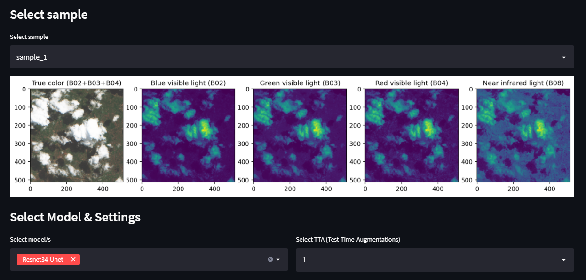
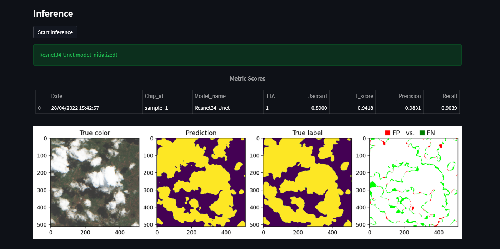

# Description
* This is a follow up demo of my work done on the "On-Cloud-N: Cloud Cover Detection Challenge"
  * Placement: Top 2% (19/854)
  * Github to Solution: https://github.com/max-schaefer-dev/on-cloud-n-19th-place-solution
* This demo showcases the performance of:
  * Each model on its own
  * Adding TTA
  * Model ensembling
* Online available: [Cloud Model Demo](https://share.streamlit.io/max-schaefer-dev/cloud-detection-demo/main/cloud_detection_demo.py)
* To-Do:
  * add post-processing options
  * prune and quantized to compress model size & speed up inference 

# Section 1: Choose Run Settings

* Choose from 5 different samples
* Choose one of the models or choose even an ensemble of model you want to predict with (3 in total)
* Choose how many TTA you want to use (Test-Time Augmentations)

# Section 2: Inference

* Different metric scores  
* Predicted vs true_label comparison
* and more...

# References
* https://github.com/fcakyon/streamlit-image-comparison