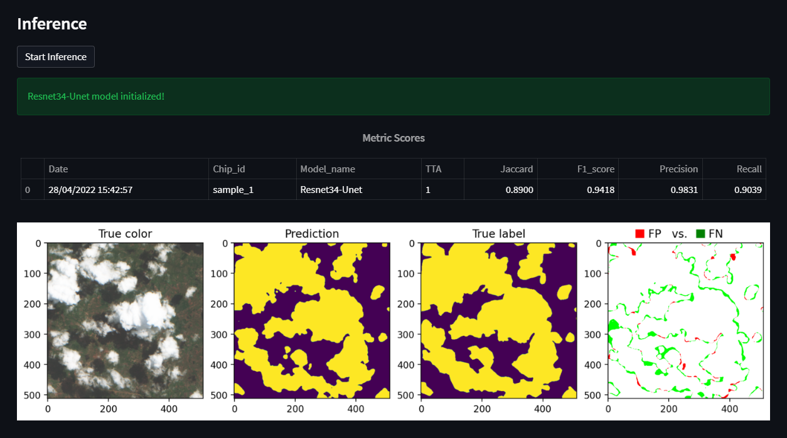

# Description
* This is a follow up demo of my work done on the "On-Cloud-N: Cloud Cover Detection Challenge"
  * Placement: Top 2% (19/854)
  * Github to Solution: https://github.com/max-schaefer-dev/on-cloud-n-19th-place-solution
* This demo showcases the performance of the model
* Online available: [Cloud Model Demo](https://share.streamlit.io/max-schaefer-dev/cloud-detection-demo/main/cloud_detection_demo.py)

# Section 1: Choose Run Settings
* Choose from 5 different samples
* Choose one of the models or choose even an ensemble of model you want to predict with (3 in total)
* Choose how many TTA you want to use (Test-Time Augmentations)

# Section 2: Inference

* 4 metric scores  
* predicted vs true_label comparison
* and more...